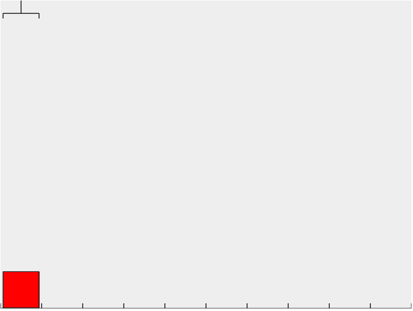
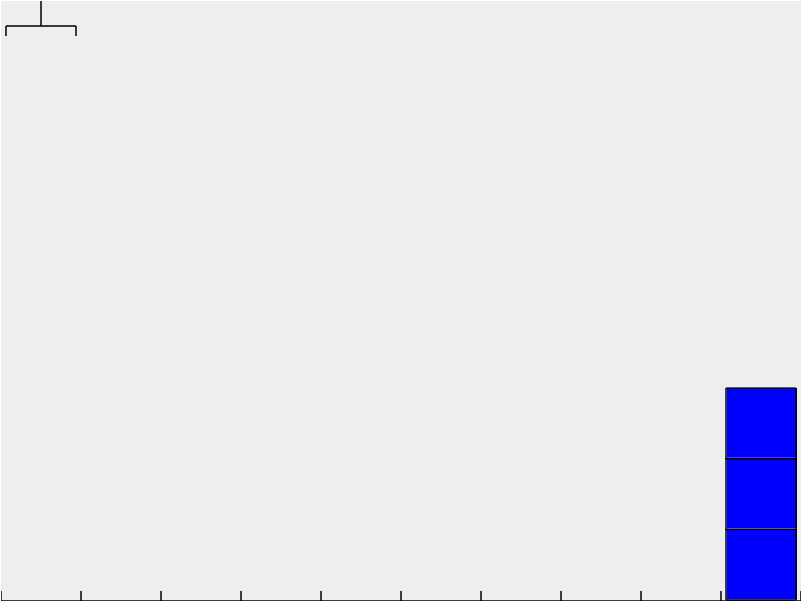
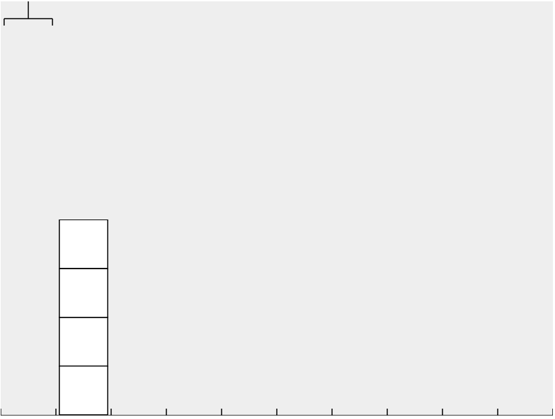
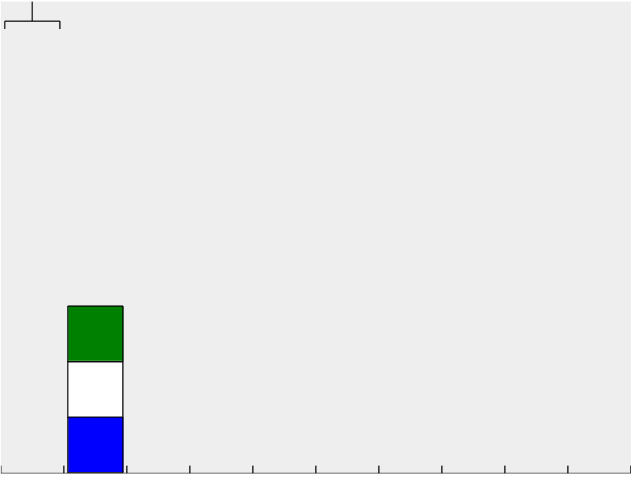
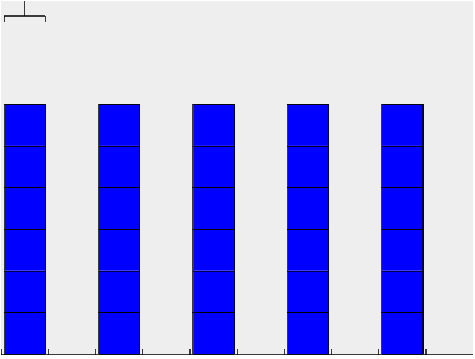
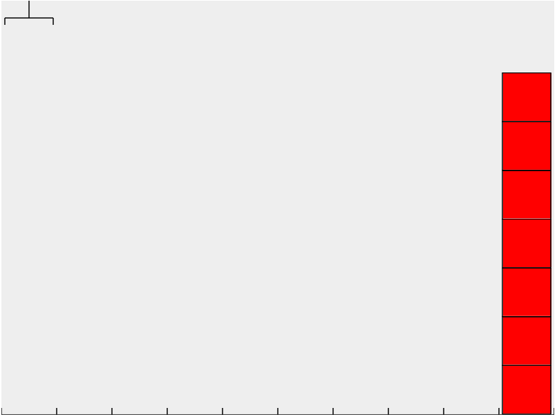
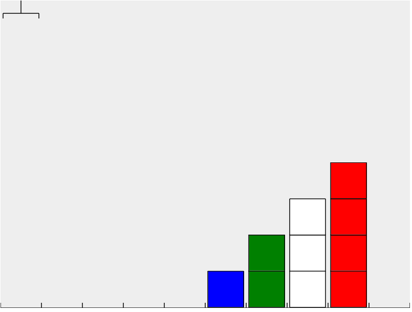
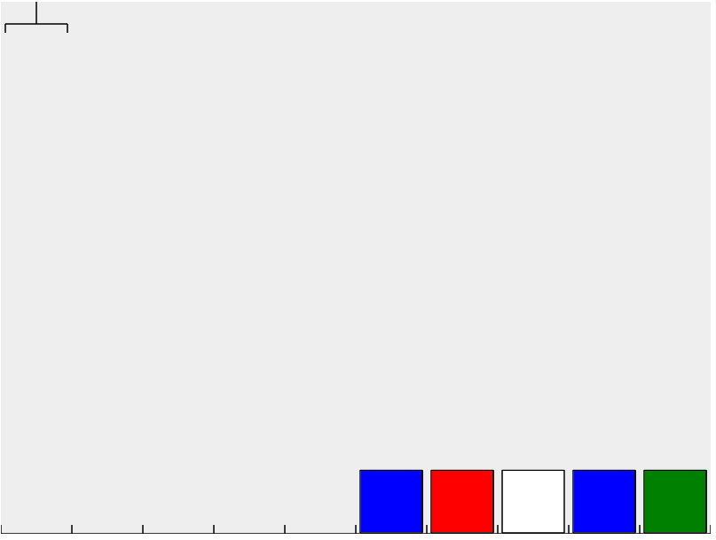
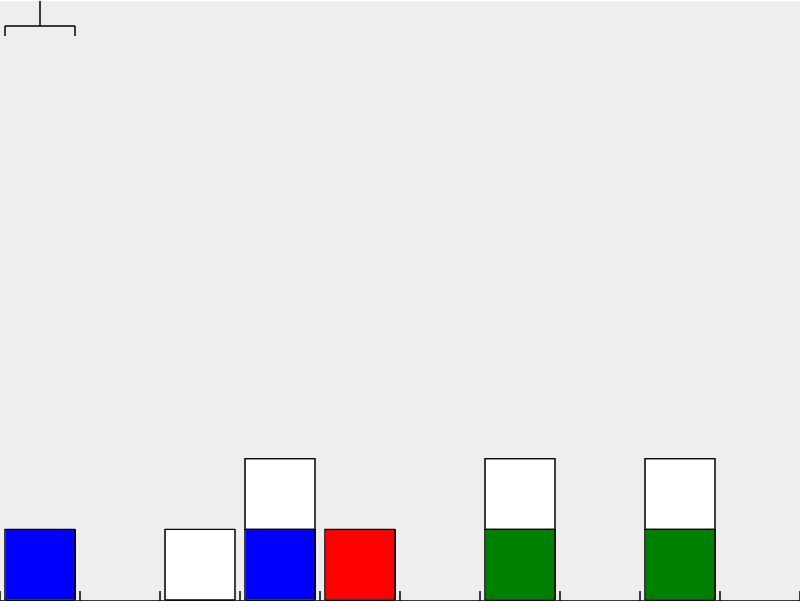
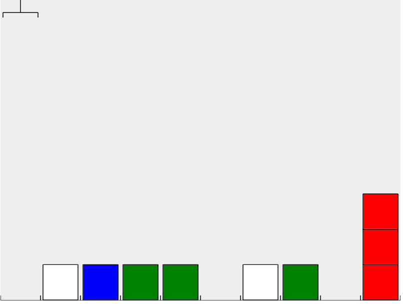

##Oefening 1
```javascript
robotArm.loadLevel("exercise 1");
```
Verplaats het rode blok één plek naar links.



##Oefening 2
```javascript
robotArm.loadLevel("exercise 2");
```
Stappel alle blokken op aan de rechterkant.



##Oefening 3
```javascript
robotArm.loadLevel("exercise 3");
```
Verplaats de hele stapel blokken één plek naar rechts.



##Oefening 4
```javascript
robotArm.loadLevel("exercise 4");
```
Verplaats de hele stapel blokken één plek naar rechts. Zorg ervoor dat de volgorde van de blokken gelijk blijft.



##Oefening 5
```javascript
robotArm.loadLevel("exercise 6");
```
Verplaats alle blokken één plek naar rechts. Zorg ervoor dat de volgorde van de blokken gelijk blijft. 



##Oefening 6
```javascript
robotArm.loadLevel("exercise 7");
```
Verplaats iedere stapel één plek naar links.

Je mag maximaal 13 regels code gebruiken!



##Oefening 7
```javascript
robotArm.loadLevel("exercise 8");
```
Verplaats de stapel naar de rechterkant.

Je mag maximaal 13 regels code gebruiken!



##Oefening 8
```javascript
robotArm.loadLevel("exercise 9");
```
Verplaats alle stapels vijf stappen naar rechts.

Je mag maximaal 15 regels code gebruiken!



##Oefening 9
```javascript
robotArm.loadLevel("exercise 10");
```
Draai de volgorde van de blokken om.

Je mag maximaal 20 regels code gebruiken!



##Oefening 10
```javascript
robotArm.loadLevel("exercise 11");
```
Verplaats alle witte blokken één plek naar rechts. 

Let op, de blokken zijn iedere keer anders als je het programma start!



##Oefening 11
```javascript
robotArm.loadLevel("exercise 11");
```
Verplaats alle rode blokken naar het einde.

Let op, de blokken zijn iedere keer anders als je het programma start!


##Oefening 12
```javascript
robotArm.randomLevel(1);
```
Verplaats alle blokken over de lege plaatsen, zodra er geen blokken meer zijn moet de arm stoppen.

[Bonus opdrachten](readme/RobotArm Puzzels (1).docx)
